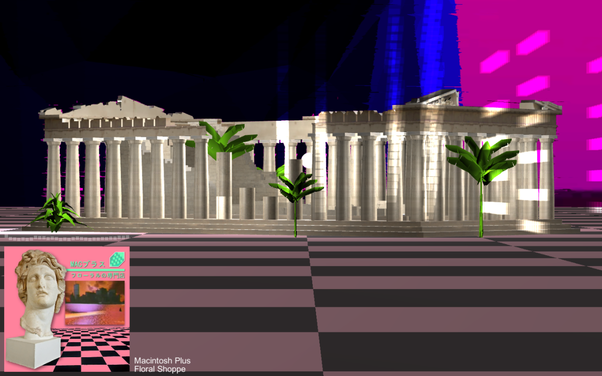

# Projects

## Follicle Abduction
A two player asymmetric co-op game, where players must work together to escape an alien space ship.      
Intro: <https://www.youtube.com/watch?v=aLSUML0rpxI>      
Repository: <https://github.com/taurheim/Fungi/wiki>         

## Cube War
A multiplayer first person shooter in a destructible environment made of cubes. Made with Unity and C#.              

## Vaporworld
An interactive world designed to visually compliment vaporwave music.        
Demo: <https://www.youtube.com/watch?v=jADlmV4CGWE>       
Repository: <https://github.com/huot14/vaporworld>     

## Darkzone
The enemies only move when you are not looking. The player gets a flashlight and tries to stay alive. Inspired by the Weeping Angels from Doctor Who. Created mainly as a concept for a horror/thriller game. Made with Unity and C#.

## OpenGL Terrain
Generating and modifying terrain with OpenGL. For a computer graphics course assignment.      
Repository: <https://github.com/huot14/terrain>       

