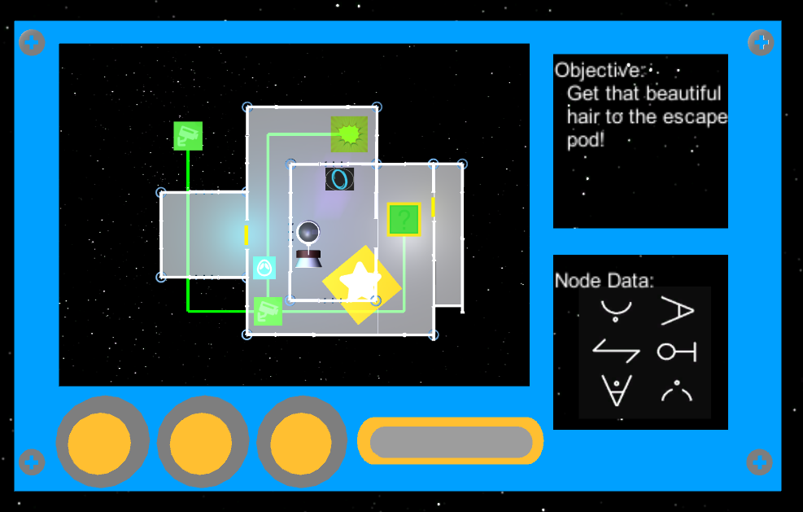
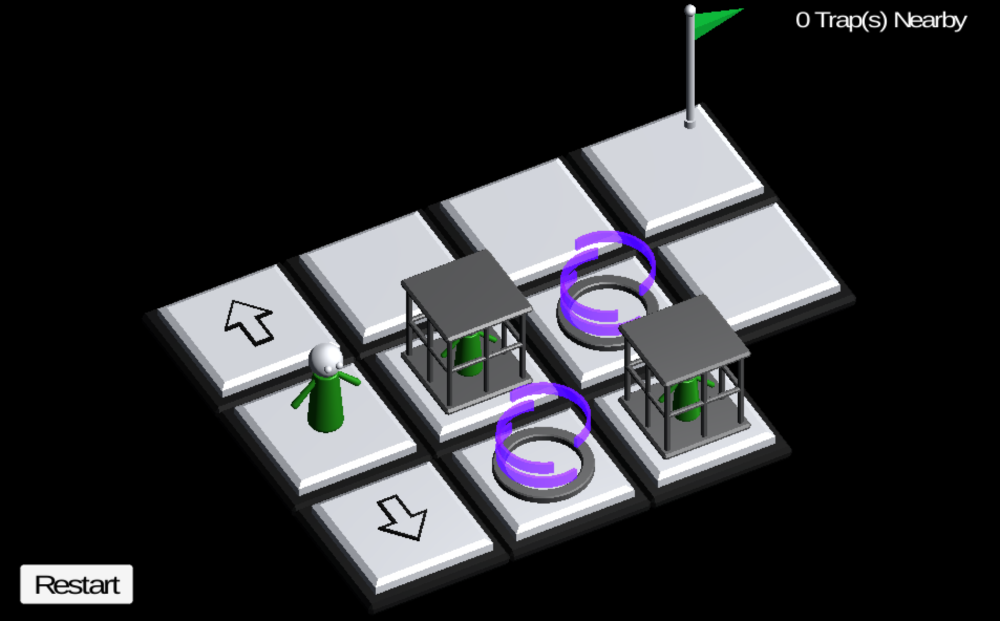
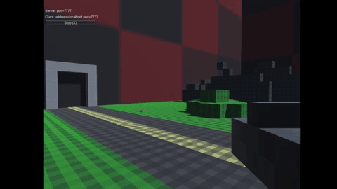
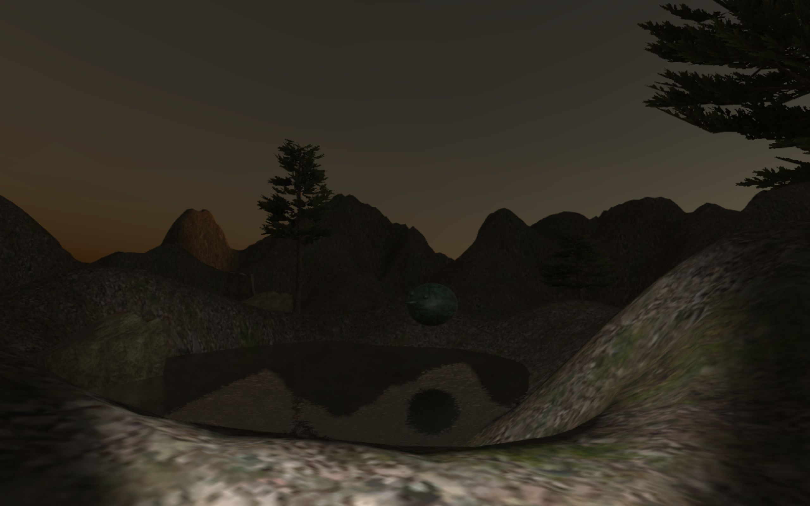
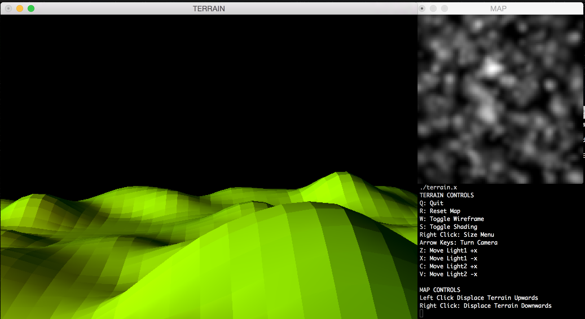

# Projects

## Follicle Abduction
A two player asymmetric co-op game, where players must work together to escape an alien space ship. One player plays as a human trying to escape while the other is an alien trying to help.      
Intro: <https://www.youtube.com/watch?v=aLSUML0rpxI>      
Repository: <https://github.com/taurheim/Fungi/wiki>         
               
*Beginning of game, the human player must find the correct door to open*            

            
*Opening the correct door*        

         
*Sneaking past a guard*         

        
*Finding a fuel cell for the escape pod*        

         
*The view of the alien player*    

## You or me
A single player puzzle solving game inspired by minesweeper, where players must traverse through a level without activating traps. Created for the Ludum Dare 43.
Repository: https://github.com/huot14/LD43

## Cube War
A multiplayer first person shooter in a destructible environment made of cubes. Made with Unity and C#.              

## Vaporworld
An interactive world designed to visually compliment vaporwave music.        
Demo: <https://www.youtube.com/watch?v=jADlmV4CGWE>       
Repository: <https://github.com/huot14/vaporworld>       

## Darkzone
The enemies only move when you are not looking. The player gets a flashlight and tries to stay alive. Inspired by the Weeping Angels from Doctor Who. Created mainly as a concept for a horror/thriller game. Made with Unity and C#.

## OpenGL Terrain
Generating and modifying terrain with OpenGL. For a computer graphics course assignment.      
Repository: <https://github.com/huot14/terrain>       

